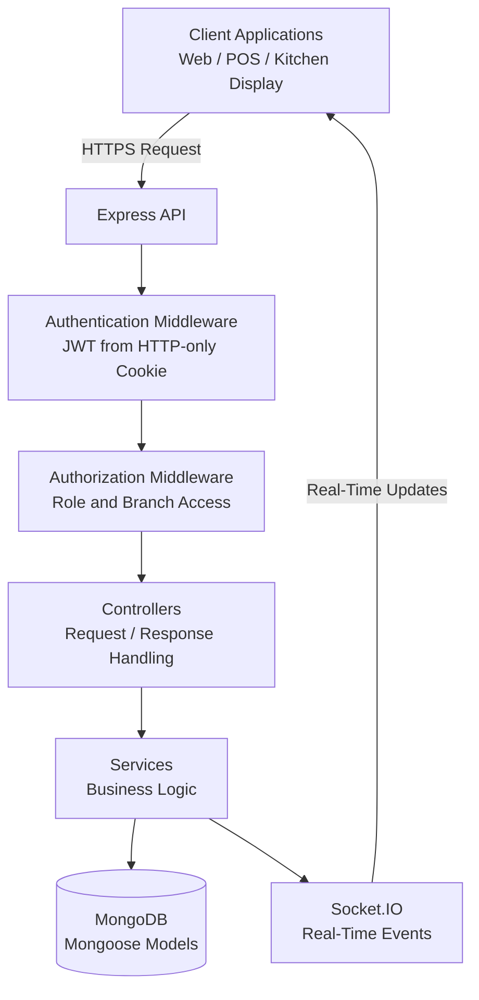
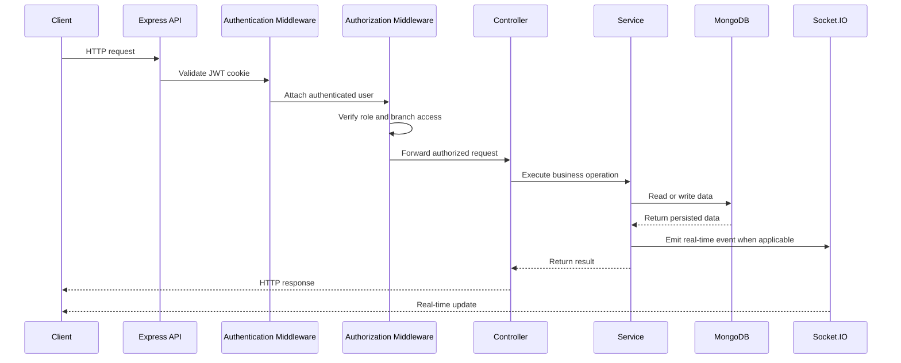
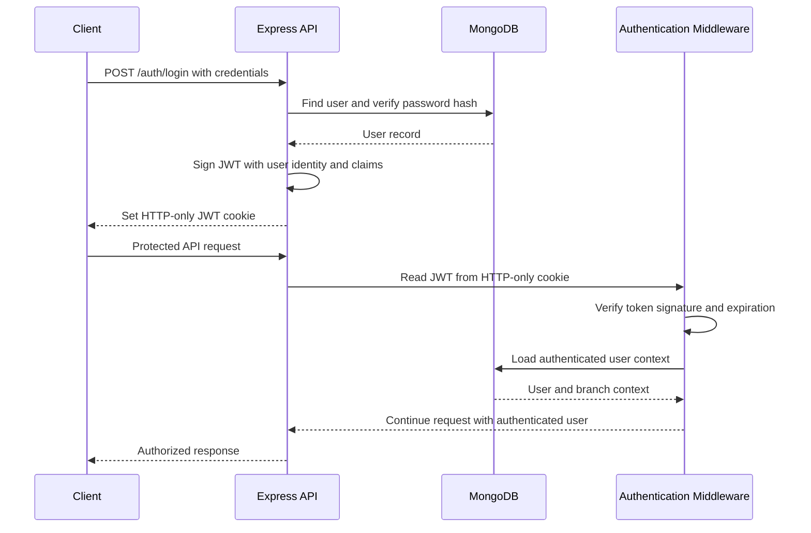
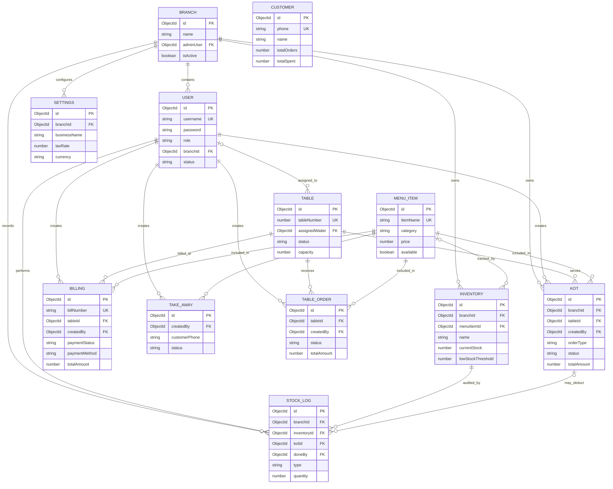

# KOT POS Backend

[](https://nodejs.org/)
[](https://expressjs.com/)
[](https://www.mongodb.com/)
[](https://socket.io/)
[](LICENSE)

Production-focused backend for a multi-branch restaurant Point of Sale and Kitchen Order Ticket (KOT) platform.

---

## Table of Contents

- [Project Overview](#-project-overview)
- [Backend Engineering Highlights](#-backend-engineering-highlights)
- [Tech Stack](#-tech-stack)
- [Folder Structure](#-folder-structure)
- [Environment Variables](#-environment-variables)
- [Installation & Setup](#-installation--setup)
- [API Endpoints](#-api-endpoints)

---

## Project Overview

KOT POS Backend is a RESTful, real-time backend designed to coordinate restaurant operations across branches—from order placement and kitchen workflows to billing, inventory, and reporting.

The API uses JWT-based authentication delivered through HTTP-only cookies, role-based authorization, and Socket.IO events to support secure, responsive workflows for administrators, cashiers, waiters, and kitchen staff.

## Backend Engineering Highlights

- **JWT Authentication** — Stateless session authentication with signed JWTs.
- **HTTP-only Cookies** — Reduces client-side token exposure and XSS risk.
- **Role-Based Access Control** — Enforces distinct Admin, Cashier, Waiter, and Chef permissions.
- **Socket.IO Real-Time Events** — Supports live KOT status updates and role-aware operational workflows.
- **Multi-Branch Architecture** — Scopes users, orders, inventory, and operational data by restaurant branch.
- **Inventory Management** — Tracks stock-related workflows alongside menu and order operations.
- **Billing & Payments** — Converts completed KOTs into billing records and payment flows.
- **Operational Reports** — Provides daily sales, revenue summaries, and business reporting endpoints.
- **Security Hardening** — Protects privileged registration paths, production-only routes, authentication boundaries, and role trust.

---

## System Architecture



### Components

- **Client** — Web, POS, and kitchen-display clients consume REST APIs and receive real-time updates.
- **Express API** — Defines HTTP endpoints, applies global middleware, and routes requests.
- **Authentication Middleware** — Validates JWTs supplied through HTTP-only cookies and establishes the authenticated user context.
- **Authorization Middleware** — Enforces role-based and branch-scoped access before protected operations execute.
- **Controllers** — Translate validated HTTP requests into application operations and return consistent responses.
- **Services** — Encapsulate business rules for orders, inventory, billing, reports, and branch operations.
- **MongoDB** — Persists operational data through Mongoose schemas and models.
- **Socket.IO** — Emits authenticated, branch-aware events for KOT status and operational updates.

### Request Lifecycle



### Authentication Flow



---

## Database Design



### Collections

- **Branch** — Restaurant location metadata, activation state, and assigned administrative owner.
- **User** — Authenticated staff identities, password hashes, roles, statuses, and optional branch membership.
- **KOT** — Kitchen Order Tickets containing order type, table context, item snapshots, status, total, creator, and branch ownership.
- **Billing** — Billing records with bill numbers, payment state, payment method, item snapshots, and cashier ownership.
- **MenuItem** — Menu catalog entries, categories, prices, and availability state.
- **Inventory** — Branch-scoped stock records, linked optionally to menu items, with thresholds and supplier metadata.
- **StockLog** — Auditable inventory movements, including restocks, adjustments, returns, and KOT-driven deductions.
- **Table** — Dining-floor table state, capacity, current customer details, and assigned waiter.
- **TableOrder** — Dine-in order workflow records linked to a table and staff member.
- **TakeAway** — Takeaway order workflow records with customer details, items, status, and creator.
- **Customer** — Reusable customer profiles and aggregate visit/spend metrics.
- **Settings** — Restaurant and branch-level business, billing, operational, and notification configuration.

### Relationships

- A **Branch** owns branch-scoped users, KOTs, inventory, stock logs, and settings.
- A **User** creates operational records such as KOTs, bills, takeaway orders, table orders, and stock adjustments.
- A **Table** can have multiple KOTs, bills, and table orders over time.
- KOTs, bills, takeaway orders, and table orders embed item snapshots while retaining references to their source **MenuItem** records.
- **Inventory** may reference a menu item; every inventory movement is recorded in **StockLog**.
- A stock log may reference the KOT that caused its deduction, preserving traceability from order to inventory movement.

### Indexing Strategy

- **Unique indexes** protect global identifiers and login lookups:
  - `User.username`
  - `Billing.billNumber`
  - `MenuItem.ItemName`
  - `Table.tableNumber`
  - `Customer.phone`

- **Branch-scoped indexes** support tenant-aware operational queries:
  - `Kot: { branchId, status }` for kitchen queues.
  - `Kot: { branchId, createdAt }` for recent orders and reporting.
  - `Inventory: { branchId, isActive }` for active stock listings.
  - `Inventory: { branchId, currentStock }` for low-stock workflows.
  - `User: { branchId, role }` for branch staff management.

- **Workflow indexes** optimize frequent lookups:
  - `StockLog: { inventoryId, createdAt }` for inventory audit history.
  - `Kot: { createdBy, createdAt }` for waiter-specific order history.
  - `Kot: { tableId, status }` for active table orders.
  - `MenuItem: { category, available }` for menu browsing and availability filtering.

- **Text indexes** support customer, bill, and menu search where enabled:
  - KOT customer name and phone.
  - Billing customer name, phone, and bill number.
  - Menu item name.

### Branch Isolation

Branch isolation is enforced by carrying `branchId` through authentication context, authorization middleware, and branch-owned operational collections.

- JWT claims include the authenticated user’s `branchId`.
- Authorization should scope every branch-owned read, update, and delete query with the authenticated branch identifier.
- KOTs, inventory records, stock logs, settings, and branch-bound users persist `branchId` directly.
- Super-administrator users may have a `null` branch assignment and require explicit elevated authorization before accessing cross-branch data.
- Branch-aware compound indexes keep tenant-scoped queries efficient as the number of branches and operational records grows.

> Database-level branch isolation is strongest when every branch-owned operational collection persists and queries by `branchId`. Collections that derive branch context through related records should be consistently scoped through those relationships.

---

## Security

Security is designed as a cross-cutting concern across HTTP APIs, real-time events, authentication, authorization, and production deployment.

### JWT Authentication

- Authentication uses signed JSON Web Tokens (JWTs) to establish user identity.
- Access tokens carry the authenticated user context, including role and branch scope.
- Tokens are validated before protected HTTP routes and Socket.IO connections are allowed to proceed.
- Expiration limits reduce the impact of a compromised token.

### HTTP-only Cookies

- JWTs are delivered through **HTTP-only cookies** rather than browser-accessible storage.
- `httpOnly` prevents JavaScript from reading authentication cookies, reducing token exposure through XSS.
- Production cookie settings should use `secure`, appropriate `sameSite` values, and a restricted domain/path scope.

### Role-Based Authorization

- Authorization is enforced after authentication through role-aware middleware.
- Privileged operations are limited to approved roles such as Admin, Cashier, Waiter, Chef, and Manager.
- Public registration defaults to a safe, least-privileged role.
- Administrative roles cannot be self-assigned through public registration.

### Socket.IO Authentication

- Socket.IO connections are authenticated during the handshake using the verified user identity.
- Client-supplied role values are not trusted.
- Socket rooms are assigned from authenticated role and branch claims.
- Branch-aware room membership prevents users from subscribing to unauthorized operational updates.

### Input Validation

- Request payloads should be validated before reaching business logic or persistence layers.
- Mongoose schemas enforce required fields, enumerations, numeric boundaries, and reference constraints.
- Sensitive identifiers, status transitions, prices, quantities, and user-controlled role values require server-side validation.

### Rate Limiting

- Rate limiting should protect public and authentication-sensitive endpoints from brute-force attempts, credential stuffing, and abusive traffic.
- Apply stricter limits to login, registration, password recovery, and token-refresh endpoints.
- Use IP-aware limits with trusted-proxy configuration when deployed behind a reverse proxy.

### CORS

- Cross-Origin Resource Sharing (CORS) should allow only approved frontend origins in production.
- Credentialed requests must use explicit origins rather than wildcard configuration.
- Cookie-based authentication requires `credentials: true` on both the client and server configuration.

### Helmet

- Helmet should be enabled to apply secure HTTP response headers.
- Recommended protections include content security policy, clickjacking protection, MIME-type sniffing prevention, and referrer-policy controls.
- Security headers should be verified in the production deployment environment.

### Security Hardening Completed

- Removed public administrator registration and enforced a safe default role for public sign-up.
- Removed production exposure of development-only test routes.
- Removed hard-coded IDs and data-writing test endpoints.
- Added environment-aware validation that development test routes are unavailable in production.
- Secured Socket.IO handshakes and removed trust in client-provided authorization claims.
- Scoped real-time rooms by authenticated role and branch context.

### Production Best Practices

- Store secrets only in environment variables or a managed secrets service; never commit `.env` files.
- Use strong, rotated JWT secrets and separate access-token and refresh-token secrets.
- Enforce HTTPS and secure cookies in production.
- Log authentication failures and authorization denials without recording passwords, tokens, or sensitive personal data.
- Monitor dependency vulnerabilities and keep runtime dependencies updated.
- Apply database least privilege, backups, encryption at rest, and network access restrictions.
- Add centralized error handling that returns safe client responses while retaining actionable server-side logs.
- Run automated tests, linting, security scans, and database-index checks in CI before deployment.

---

## Deployment

### Docker

Build and run the API as a container:

```bash
docker build -t kot-pos-backend .
docker run --env-file .env -p 3000:3000 kot-pos-backend
```

Recommended production Docker practices:

- Use a multi-stage build to keep the runtime image small.
- Run the application as a non-root user.
- Exclude `.env`, `node_modules`, logs, and local artifacts with `.dockerignore`.
- Inject secrets at runtime; never bake them into the image.
- Set `NODE_ENV=production`.

### Docker Compose

Use Docker Compose to run the API and MongoDB locally or in a self-managed environment:

```yaml
services:
  api:
    build: .
    ports:
      - "3000:3000"
    env_file:
      - .env
    depends_on:
      mongo:
        condition: service_healthy
    restart: unless-stopped

  mongo:
    image: mongo:7
    ports:
      - "27017:27017"
    volumes:
      - mongo-data:/data/db
    healthcheck:
      test: ["CMD", "mongosh", "--eval", "db.adminCommand('ping')"]
      interval: 10s
      timeout: 5s
      retries: 5
    restart: unless-stopped

volumes:
  mongo-data:
```

Start the stack:

```bash
docker compose up --build -d
```

### MongoDB Atlas

For managed MongoDB:

1. Create a MongoDB Atlas project and cluster.
2. Create a least-privileged database user for the application.
3. Add production server IP addresses to the Atlas network access list.
4. Copy the Atlas connection string.
5. Set it as `MONGO_URI` in the deployment environment.
6. Enable backups, monitoring, alerts, and encryption features appropriate to the environment.

Example:

```env
MONGO_URI=mongodb+srv://<username>:<password>@<cluster>/<database>?retryWrites=true&w=majority
```

### Environment Variables

Configure secrets through the deployment platform’s environment-variable or secrets-management system.

```env
NODE_ENV=production
PORT=3000

MONGO_URI=mongodb+srv://<username>:<password>@<cluster>/<database>
JWT_SECRET=<strong-random-secret>
REFRESH_TOKEN_SECRET=<strong-random-secret>
JWT_EXPIRES_IN=15m
COOKIE_EXPIRES_IN=7

CLIENT_URL=https://your-frontend.example.com
```

Required production practices:

- Use long, cryptographically random JWT secrets.
- Keep access-token and refresh-token secrets separate.
- Never commit `.env` files or expose secrets in logs.
- Rotate secrets when credentials are suspected to be compromised.
- Configure the production frontend origin explicitly for CORS.

### Health Check Endpoint

Expose a lightweight, unauthenticated health endpoint for load balancers and deployment platforms:

```http
GET /health
```

A healthy response should return:

```json
{
  "status": "ok"
}
```

The endpoint should verify that the process is responsive and, when appropriate, report database readiness without exposing internal infrastructure details.

Example Docker health check:

```dockerfile
HEALTHCHECK --interval=30s --timeout=5s --start-period=10s --retries=3 \
  CMD node -e "fetch('http://localhost:3000/health').then(r => process.exit(r.ok ? 0 : 1)).catch(() => process.exit(1))"
```

### CI/CD

A production CI/CD pipeline should run on every pull request and protected-branch deployment.

Recommended pipeline stages:

1. Install dependencies with `npm ci`.
2. Run linting and formatting checks.
3. Run unit, integration, authentication, authorization, and Socket.IO tests.
4. Run dependency and security scans.
5. Build the Docker image.
6. Publish a versioned image to a container registry.
7. Deploy to staging.
8. Run smoke tests, including the health check.
9. Promote the verified image to production.
10. Monitor error rate, latency, logs, and database health after release.

Example GitHub Actions test step:

```yaml
- name: Install dependencies
  run: npm ci

- name: Run tests
  run: npm test
```

### Production Deployment Steps

1. Provision the production runtime environment, such as a container platform, virtual machine, or Kubernetes cluster.
2. Configure MongoDB Atlas or a secured managed MongoDB deployment.
3. Add production environment variables and secrets through the hosting provider.
4. Configure HTTPS termination and force secure traffic.
5. Set cookie security flags for production: `httpOnly`, `secure`, and an appropriate `sameSite` policy.
6. Restrict CORS to approved frontend origins.
7. Deploy the versioned Docker image.
8. Confirm `GET /health` returns a successful response.
9. Verify login, role-based routes, branch-scoped access, and Socket.IO authentication.
10. Enable centralized logs, alerts, metrics, backups, and rollback procedures.

---

## 🛠 Tech Stack

| Layer         | Technology                  |
| ------------- | --------------------------- |
| Runtime       | Node.js                     |
| Framework     | Express.js                  |
| Database      | MongoDB                     |
| ODM           | Mongoose                    |
| Auth          | JWT (via HTTP-only Cookies) |
| Body Parsing  | express.json, body-parser   |
| Cookie Parser | cookie-parser               |

---

## 📁 Folder Structure

```
kot/
├── config/
│   └── Database.js           # MongoDB connection
├── routes/
│   ├── auth.js               # Auth routes
│   ├── testRouter.js         # Dev/test routes
│   ├── admin/
│   │   ├── adminUser.js      # Admin user management
│   │   ├── adminMenu.js      # Menu management
│   │   └── adminTable.js     # Table management
│   ├── cashier/
│   │   ├── cashierBilling.js # Billing
│   │   ├── cashierKotOrder.js# KOT orders
│   │   └── cashierReports.js # Reports
│   ├── waiter/
│   │   ├── waiterOrderRouter.js  # Order placement
│   │   └── waiterTableRouter.js  # Table status
│   └── chef/
│       └── chefRouter.js     # KOT queue
├── .env
├── package.json
└── server.js                 # Entry point
```

---

## 🔐 Environment Variables

Create a `.env` file in the root of the project:

```env
PORT=3000
MONGO_URI=mongodb://localhost:27017/kot
JWT_SECRET=your_jwt_secret_key
JWT_EXPIRES_IN=7d
COOKIE_EXPIRES_IN=7
NODE_ENV=development
```

| Variable            | Description                       |
| ------------------- | --------------------------------- |
| `PORT`              | Server port (default: 3000)       |
| `MONGO_URI`         | MongoDB connection string         |
| `JWT_SECRET`        | Secret key for signing JWT tokens |
| `JWT_EXPIRES_IN`    | JWT expiry duration (e.g. `7d`)   |
| `COOKIE_EXPIRES_IN` | Cookie expiry in days             |
| `NODE_ENV`          | `development` or `production`     |

---

## 🚀 Installation & Setup

### Prerequisites

- Node.js `v18+`
- MongoDB running locally or a MongoDB Atlas URI

### Steps

```bash
# 1. Clone the repository
git clone https://github.com/Pandikumarcodes/Kot-Pos-Backend.git
cd kot

# 2. Install dependencies
npm install

# 3. Create environment file
cp .env.example .env
# Then edit .env with your values

# 4. Start the server
node server.js

# Or with nodemon for development
npx nodemon server.js
```

Server will start at: `http://localhost:3000`

---

## 📡 API Endpoints

All routes use `http://localhost:3000` as the base URL.  
Protected routes require a valid JWT stored in an HTTP-only cookie (set on login).

---

### 🔐 Auth — `/auth`

| Method | Endpoint         | Description                   | Access  |
| ------ | ---------------- | ----------------------------- | ------- |
| POST   | `/auth/register` | Register a new user           | Public  |
| POST   | `/auth/login`    | Login and receive auth cookie | Public  |
| POST   | `/auth/logout`   | Logout and clear cookie       | Private |
| GET    | `/auth/profile`  | Get current user's profile    | Private |

---

### 👤 Admin — Users `/admin`

| Method | Endpoint           | Description              | Access |
| ------ | ------------------ | ------------------------ | ------ |
| GET    | `/admin/users`     | List all users           | Admin  |
| POST   | `/admin/users`     | Create a new staff user  | Admin  |
| GET    | `/admin/users/:id` | Get a user by ID         | Admin  |
| PUT    | `/admin/users/:id` | Update user details/role | Admin  |
| DELETE | `/admin/users/:id` | Delete a user            | Admin  |

---

### 🍽️ Admin — Menu `/admin`

| Method | Endpoint          | Description           | Access |
| ------ | ----------------- | --------------------- | ------ |
| GET    | `/admin/menu`     | Get all menu items    | Admin  |
| POST   | `/admin/menu`     | Add a new menu item   | Admin  |
| GET    | `/admin/menu/:id` | Get a menu item by ID | Admin  |
| PUT    | `/admin/menu/:id` | Update a menu item    | Admin  |
| DELETE | `/admin/menu/:id` | Delete a menu item    | Admin  |

---

### 🪑 Admin — Tables `/admin`

| Method | Endpoint            | Description          | Access |
| ------ | ------------------- | -------------------- | ------ |
| GET    | `/admin/tables`     | List all tables      | Admin  |
| POST   | `/admin/tables`     | Add a new table      | Admin  |
| GET    | `/admin/tables/:id` | Get a table by ID    | Admin  |
| PUT    | `/admin/tables/:id` | Update table details | Admin  |
| DELETE | `/admin/tables/:id` | Remove a table       | Admin  |

---

### 💳 Cashier — Billing `/cashier`

| Method | Endpoint                   | Description            | Access  |
| ------ | -------------------------- | ---------------------- | ------- |
| GET    | `/cashier/billing`         | Get all bills          | Cashier |
| POST   | `/cashier/billing/:kotId`  | Generate bill from KOT | Cashier |
| PATCH  | `/cashier/billing/:id/pay` | Mark a bill as paid    | Cashier |

---

### 🧾 Cashier — KOT Orders `/cashier`

| Method | Endpoint                  | Description            | Access  |
| ------ | ------------------------- | ---------------------- | ------- |
| GET    | `/cashier/kot`            | Get all KOT orders     | Cashier |
| POST   | `/cashier/kot`            | Create a new KOT order | Cashier |
| PATCH  | `/cashier/kot/:id/cancel` | Cancel a KOT order     | Cashier |

---

### 📊 Cashier — Reports `/cashier`

| Method | Endpoint                   | Description             | Access  |
| ------ | -------------------------- | ----------------------- | ------- |
| GET    | `/cashier/reports/daily`   | Daily sales report      | Cashier |
| GET    | `/cashier/reports/summary` | Revenue summary & stats | Cashier |

---

### 🧑‍🍳 Waiter `/waiter`

| Method | Endpoint                    | Description                     | Access |
| ------ | --------------------------- | ------------------------------- | ------ |
| GET    | `/waiter/orders`            | View all assigned orders        | Waiter |
| POST   | `/waiter/orders`            | Place a new order for a table   | Waiter |
| PATCH  | `/waiter/orders/:id`        | Update/add items to an order    | Waiter |
| GET    | `/waiter/tables`            | Get all tables and their status | Waiter |
| PATCH  | `/waiter/tables/:id/status` | Update table status             | Waiter |

---

### 👨‍🍳 Chef `/chef`

| Method | Endpoint              | Description                  | Access |
| ------ | --------------------- | ---------------------------- | ------ |
| GET    | `/chef/kot`           | View all pending KOT tickets | Chef   |
| PATCH  | `/chef/kot/:id/start` | Mark KOT as in preparation   | Chef   |
| PATCH  | `/chef/kot/:id/ready` | Mark KOT as ready to serve   | Chef   |

---

### 🧪 Test `/test` _(Dev Only)_

| Method | Endpoint           | Description                  | Access  |
| ------ | ------------------ | ---------------------------- | ------- |
| GET    | `/test/ping`       | Server health check          | Public  |
| GET    | `/test/auth-check` | Verify cookie/JWT auth works | Private |

---

## 📝 Notes

- All private routes expect a valid JWT cookie set during `/auth/login`
- Role-based middleware should restrict routes to their respective roles (Admin, Cashier, Waiter, Chef)
- The `adminReportRouter` and `cashierOnlineRouter` are commented out and reserved for future use

---

## 📄 License

[MIT](LICENSE)
