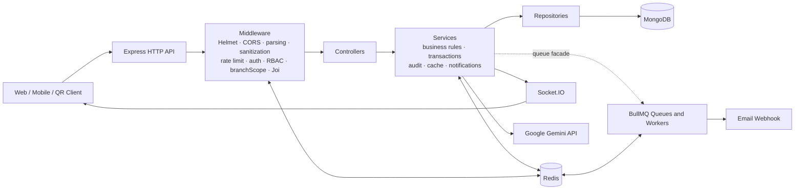
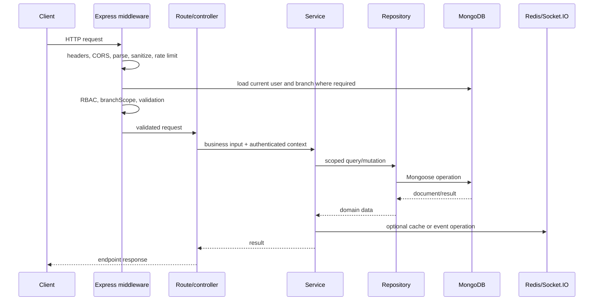
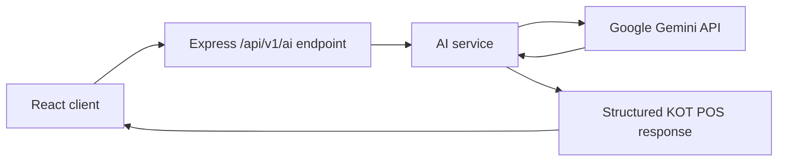

# Backend Architecture

This document describes the architecture implemented by the current KOT POS backend. It is not a target-state design.

## System context

## Application bootstrap

`src/app.js` is both the application composition root and executable bootstrap. There is no separate server bootstrap file.

Startup order:

1. Override Node DNS resolvers for the repository's Atlas/Windows workaround.
2. Load `.env`.
3. Create the Express app, HTTP server, and Socket.IO server.
4. Install lifecycle state, shutdown management, and signal handlers.
5. Install global middleware and rate limiters.
6. Mount Swagger, API routers, health endpoints, 404 handling, and error handling.
7. Validate the environment.
8. Connect MongoDB.
9. reconcile required and optional indexes.
10. Attempt the optional Redis connection.
11. Optionally start BullMQ when explicitly enabled.
12. Start listening and move lifecycle state to `ready`.

Startup failures in environment validation, MongoDB connection, or mandatory index creation terminate the process. Redis cache connection failure is logged and does not terminate startup.

## Layer responsibilities

### Routes

Routes define the public HTTP contract:

- HTTP method and path.
- Authentication and allowed roles.
- Branch and branch-member context.
- Joi validators.
- Controller dispatch.

All business APIs are mounted under `/api/v1`; health, version, and documentation endpoints are top-level.

### Middleware

Middleware performs cross-cutting request work:

- Helmet security headers and CSP.
- Exact-origin CORS.
- 10 KB body limits.
- Cookie parsing.
- Body and parameter Mongo sanitization.
- Request logging and audit request context.
- Redis-backed rate limiting.
- JWT authentication and current-user loading.
- Role authorization.
- Branch context and inactive-branch checks.
- Joi validation.

Order matters: role checks and branch context occur before controllers, while router-local error handlers occur after controller dispatch.

### Controllers

Controllers translate Express inputs into service arguments and construct endpoint-specific response envelopes. They are mostly thin, although legacy response/error shapes remain inconsistent.

### Services

Services own:

- Business invariants and state transitions.
- Transaction boundaries.
- Branch-aware query plans.
- Audit-event production.
- Cache lookup/invalidation.
- Socket.IO notifications.
- Calls to Gemini and background-job infrastructure.

### Repositories

Repositories wrap Mongoose models and centralize:

- Scoped reads and mutations.
- Projection, sort, skip, limit, and lean behavior.
- Aggregation pipelines.
- Mongo session propagation.

`BaseRepository` provides common operations; specialized repositories add domain queries.

### Models and MongoDB

Mongoose models define persistence fields, validation, relationships, and schema indexes. `src/models/indexes.js` additionally reconciles mandatory ownership indexes and creates optional performance indexes during startup.

## Request lifecycle

## Branch context

For a non-superadmin, `branchScope` uses only `req.user.branchId` loaded from MongoDB. It exposes:

- `req.branchId`
- `req.branchFilter`
- `req.scopeToBranch(filter)`
- `req.branchMemberFilter`
- `req.scopeToBranchMembers(filter)`

The branch is loaded on each scoped request and must be active. A superadmin must be branchless; it can supply a validated query `branchId` when a future route permits operational selection, but current operational RBAC excludes superadmin.

Data ownership is mixed:

- Direct branch ownership: Table, Inventory, StockLog, KOT, Settings.
- Indirect creator-membership scope: Billing, TableOrder, TakeAway.
- Global data: MenuItem and Customer.

See [Database](DATABASE.md) for the exact model matrix.

## Query infrastructure

`QueryBuilder` creates immutable query plans from allowlisted policy definitions. It supports pagination, search, filtering, sorting, field selection, and date ranges while composing server-trusted constraints separately from client input.

ObjectIds and Dates in trusted constraints retain their BSON prototypes because only plain objects and arrays are recursively cloned and frozen. Mongoose casts validated client ObjectId strings.

Several list endpoints retain legacy behavior: pagination is applied only when `page` or `limit` is explicitly supplied.

## Cross-cutting infrastructure

### Redis

Redis serves three independent concerns:

- Optional application cache.
- Shared rate-limit counters.
- BullMQ transport through a separate `ioredis` connection.

Cache and rate-limit failures are fail-open. BullMQ startup has different failure behavior; see [Redis and BullMQ](REDIS-BULLMQ.md).

### BullMQ

Four queues and workers exist for email, inventory alerts, reports, and cleanup. Background processing is opt-in at application startup.

### Socket.IO

Socket.IO uses the HTTP server and authenticates users before assigning a server-derived branch-and-role room. Services emit operational events after successful persistence/transaction completion.

### Audit events

Selected workflows create immutable `audit_events` records. Transactional audit writes participate in the business transaction; failure events are normally written outside the failed transaction so rollback does not erase the failure record.

### Google Gemini

The browser-facing abstraction remains the KOT POS REST API. Only `src/services/aiService.js` imports `GoogleGenAI` from `@google/genai`, and it reads `GEMINI_API_KEY` on the server. Its ordered model configuration is `gemini-3.1-flash-lite-preview`, `gemini-3.1-flash-preview`, then `gemini-3-flash-preview`. The implemented flow is:

The AI router authenticates admin/manager users, establishes active-branch context, and applies its dedicated rate limiter. Chat sends only an allowlisted subset of supplied dashboard context. Daily summaries query scoped operational data, cache structured and generated results for 600 seconds, and fall back to deterministic text. Inventory alerts are calculated locally and do not make a Gemini call. There is no direct browser-to-Gemini access and no fine-tuning, vector store, RAG, embedding, agent, function-calling, or provider-key exposure.

## Health and shutdown

- `/health` reports process liveness and lifecycle state.
- `/ready` checks MongoDB, Socket.IO, startup, and lifecycle readiness.
- SIGINT/SIGTERM move the process to draining, close HTTP acceptance, run registered cleanup, close Socket.IO, disconnect MongoDB, and exit.
- Redis and optional background jobs register shutdown handlers.

## Architectural boundaries and known gaps

- Module facades exist in `src/modules`, but `src/app.js` mounts route files directly.
- Authentication middleware and Socket.IO query the User model directly.
- Public order service queries Branch directly.
- Menu and Customer are not branch-owned.
- Some operational ownership is derived from a user's current branch rather than persisted on the record.
- There is no centralized table/order state machine.
- Router-local error handlers often bypass the terminal normalized error handler.
- Socket.IO has no Redis adapter and therefore no multi-instance event fan-out.
