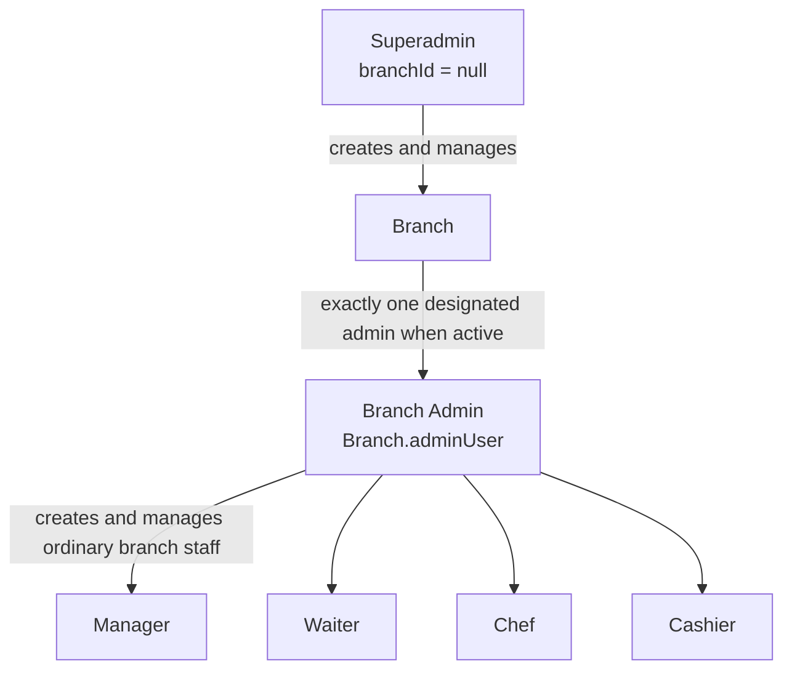

# Authentication and RBAC

## Identity model

Users have:

- Unique `username`.
- bcrypt password hash.
- Role: `superadmin`, `admin`, `manager`, `waiter`, `chef`, or `cashier`.
- Status: `active`, `locked`, or `accepted`.
- Optional `branchId`.
- Optional stored refresh-token hash.

Only active users can authenticate successfully or use protected requests. The model rejects any superadmin with a branch assignment.

## Organizational hierarchy

The hierarchy is administrative, not role inheritance. Access is granted by explicit route allowlists; a superadmin does not automatically inherit branch-operational endpoints.

## Access and refresh tokens

### Access token

- Signed with `JWT_SECRET`.
- HS256.
- 15-minute expiry.
- Contains user ID, username, role, branch ID, and `tokenType: access`.
- Accepted from the `token` cookie or `Authorization: Bearer <token>`.

The cookie is HTTP-only, available on `/`, and uses `secure` plus `SameSite=None` in production.

### Refresh token

- Signed with `REFRESH_TOKEN_SECRET`.
- HS256.
- Seven-day expiry.
- Contains user ID, a random JWT ID, and `tokenType: refresh`.
- Sent only in the `refreshToken` cookie scoped to `/api/v1/auth/refresh`.
- Stored server-side only as a SHA-256 hash.

Refresh rotates the token and replaces the stored hash, so each user has one current refresh-token chain.

## Current-user loading

Protected HTTP requests do not rely solely on role or branch claims in the JWT. Authentication verifies the access token and loads the current User document. Current status, role, and branch changes therefore apply on the next request.

The request is rejected when:

- No access token is present.
- Signature, expiry, algorithm, or payload is invalid.
- The user no longer exists.
- The account is not active.

## Login, refresh, and logout

- Login validates credentials, uses a dummy bcrypt comparison for nonexistent usernames, issues both tokens, and writes a login audit event.
- Refresh validates the presented token against the stored hash, rejects inactive users, rotates both cookies, and revokes the stored refresh token when an inactive account attempts refresh.
- Logout attempts to clear the stored refresh hash using the access-token identity, then clears both cookies. It is deliberately idempotent for invalid or expired access tokens.

Logout does not denylist the access JWT. A previously issued access token remains usable until expiry. If the access token is already invalid, the server cannot identify and revoke the stored refresh hash, although the browser cookies are still cleared.

## Password policy

- Maximum 72 UTF-8 bytes.
- `validator.isStrongPassword` default policy.
- bcrypt cost factor 12.
- Password fields are excluded from standard query selection and serialization.

There are no password-change, forgot-password, or reset-password HTTP endpoints. Queue infrastructure contains password-reset email job support but no mounted feature invokes it.

Public signup always creates a `waiter`; submitted role input is ignored. The new account is branchless and cannot use operational endpoints until the superadmin assigns it.

## Branch authority

### Superadmin invariant

A valid superadmin must have `branchId: null`. This is enforced by:

- User model validation.
- `requireSuperAdmin`.
- `branchScope`.
- Socket.IO authentication.
- Staff-assignment service rules.

### One branch admin

An active branch must point to a valid user through `Branch.adminUser`. That user must be active, have role `admin`, and have the same branch ID.

Uniqueness is backed by partial unique indexes on branch/admin relationships. Admin assignment and replacement are transactional. Replacing an admin demotes the previous admin to manager and revokes affected refresh tokens.

Generic staff endpoints cannot create, promote, remove, modify, or delete branch admins. The dedicated branch-admin lifecycle must be used.

### Inactive branches

Every non-superadmin branch-scoped HTTP request loads the assigned branch and requires `isActive === true`. Socket.IO applies the same check. Authentication and `/auth/me` can still succeed for an active user whose branch is inactive, but operational routes reject the request.

## Permission matrix

Legend: **Full** means all currently mounted operations in that area; **Read** means read-only access; **Limited** is described below.

| Capability | Superadmin | Admin | Manager | Waiter | Chef | Cashier |
|---|---:|---:|---:|---:|---:|---:|
| Current user (`/auth/me`) | Yes | Yes | Yes | Yes | Yes | Yes |
| Branch lifecycle | Full | No | No | No | No | No |
| Assign ordinary staff to branches | Full | No | No | No | No | No |
| Branch-admin lifecycle | Full | No | No | No | No | No |
| Create ordinary branch staff | No | Full | No | No | No | No |
| List branch users | No | Full | Full | No | No | No |
| Change ordinary staff roles | No | Full | Limited | No | No | No |
| Delete ordinary staff | No | Full | No | No | No | No |
| Menu | No | Full | Create/read/update | Read | Read | Read |
| Tables via admin API | No | Full | Create/read/update | No | No | Read |
| Allocate/free tables | No | Yes | Yes | Yes | No | No |
| Customers | No | Full | Create/read/update | No | No | No |
| Inventory | No | Full | Full | No | No | No |
| Admin reports | No | Full | Full | No | No | No |
| Full settings | No | Read/write | Read | No | No | No |
| Receipt settings | No | Read | Read | No | No | Read |
| Waiter order workflow | No | Yes | Yes | Yes | No | Yes |
| Kitchen/KOT workflow | No | Yes | Yes | No | Yes | No |
| Billing and takeaway | No | Yes | Yes | No | No | Yes |
| Cashier income report | No | No | No | No | No | Own only |
| AI endpoints | No | Yes | Yes | No | No | No |

Manager role changes are restricted by service rules: managers cannot assign `admin`, cannot modify admin or superadmin users, and the generic staff API only accepts manager/waiter/chef/cashier roles.

Billing deletion is currently allowed to cashier, admin, and manager. Inventory deletion is currently allowed to both admin and manager.

## Socket.IO authorization

Socket authentication accepts a handshake token, Bearer token, or access cookie, reloads the User, enforces active status and branch invariants, then joins a server-derived room. Clients cannot choose their own branch room.

Unlike HTTP verification, the current Socket.IO verifier does not explicitly restrict the JWT algorithm or validate `tokenType`; this remains a documented security gap.

## Related documentation

- [API](API.md)
- [Security](SECURITY.md)
- [Database](DATABASE.md)
