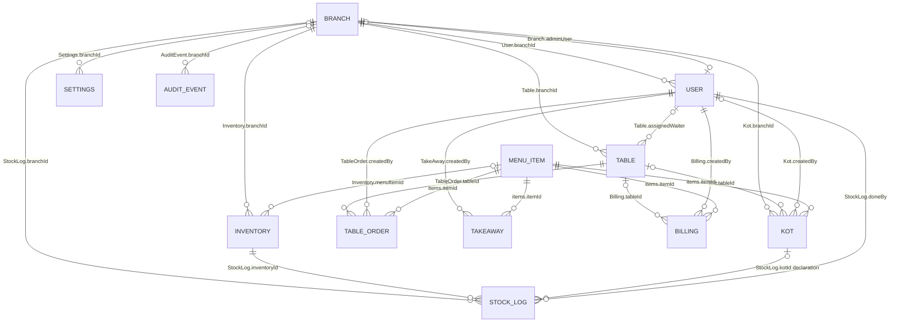

# Database Architecture and Model Reference

This document is the source-of-truth database reference for the current KOT POS backend. It was cross-checked against every file in `src/models/` and the startup index reconciler in `src/models/indexes.js`.

It distinguishes:

- Schema-declared references from workflow-only relationships.
- Schema indexes from indexes created during application startup.
- Database constraints from deterministic demo-seed counts.
- Direct branch ownership from creator-derived and global data.

## Model inventory

The repository defines 13 Mongoose models:

| Model | Source | Responsibility | Ownership model |
|---|---|---|---|
| User | `src/models/users.js` | Authentication identity, role, status, branch assignment, refresh-token state | Branch-assigned; superadmin is branchless |
| Branch | `src/models/Branch.js` | Restaurant branch and designated branch-admin pointer | Global administrative entity |
| Table | `src/models/tables.js` | Branch floor table and current occupancy state | Direct `branchId` |
| MenuItem | `src/models/menuItems.js` | Sellable menu catalog and availability | Global |
| Inventory | `src/models/Inventory.js` | Branch stock item, threshold, cost, supplier, optional menu link | Direct `branchId` |
| StockLog | `src/models/StockLog.js` | Branch stock movement history | Direct `branchId` |
| Customer | `src/models/customer.js` | Customer profile and aggregate metrics | Global |
| TableOrder | `src/models/waiter.js` | Waiter-created dine-in order | Creator-derived branch scope |
| TakeAway | `src/models/takeAway.js` | Cashier-created takeaway order | Creator-derived branch scope |
| Kot | `src/models/kot.js` | Branch-owned kitchen order ticket | Direct `branchId` |
| Billing | `src/models/billings.js` | Bill, payment state, and optional table snapshot | Creator-derived branch scope |
| Settings | `src/models/settings.js` | Global or branch restaurant/billing/receipt configuration | Optional direct `branchId` |
| AuditEvent | `src/models/AuditEvent.js` | Append-only security, financial, business, and operational audit event | Optional contextual `branchId` |

There is no `AuditLog` Mongoose model. The actual audit model is `AuditEvent`, stored explicitly in the `audit_events` collection.

Mongoose timestamps are enabled on every model except AuditEvent, which has its own required immutable `timestamp` and no automatic timestamps.

## Ownership classification

### Directly branch-owned collections

These schemas persist `branchId` and normal operational queries filter it directly:

- Table
- Inventory
- StockLog
- Kot
- Settings when a branch-specific row is used

User also persists branch assignment, but it represents organizational membership rather than an operational business record. AuditEvent can persist branch context but may validly be global.

### Creator-derived branch ownership

These schemas do not contain `branchId`:

- TableOrder
- TakeAway
- Billing

Their branch views are built through `branchMemberScope`, which finds User IDs currently assigned to the branch and applies `createdBy: { $in: memberIds }`.

Consequences:

- Historical visibility depends on the creator's current branch assignment.
- Moving a user to another branch can move that user's records between branch views.
- Removing a user's branch can make their records disappear from branch-member queries.
- Public records with `createdBy: null` are not included in this ownership strategy.

### Global collections

- MenuItem
- Customer

Neither schema contains `branchId`. Branch middleware controls which authenticated staff can call their management endpoints, but it does not isolate records. Menu names and customer phone numbers are globally unique.

## Role and branch model

### Superadmin

The database invariant is:

```text
User.role = "superadmin"
User.branchId = null
```

The User pre-validation hook rejects a superadmin with any branch ID. Middleware, Socket.IO authentication, and staff-assignment services repeat this rule.

### Branch admin

The intended bidirectional invariant is:

```text
Branch.adminUser
  ↔ User._id

User.role = "admin"
User.branchId = Branch._id
```

For an active branch, the service requires `Branch.adminUser` to identify an existing User whose role and branch match. A branch is created inactive and cannot be activated through the service until this relationship is valid.

### Required uniqueness indexes

Startup establishes and verifies:

1. A unique partial User index on `{ branchId: 1, role: 1 }` for documents where `role` is `admin` and `branchId` is an ObjectId. This permits at most one role-admin per branch without restricting multiple managers, waiters, chefs, or cashiers.
2. A unique partial Branch index on `{ adminUser: 1 }` where `adminUser` is an ObjectId. This prevents one designated admin user from being pointed to by multiple branches.
3. A unique Table index on `{ branchId: 1, tableNumber: 1 }`. This permits repeated table numbers across branches but not within one branch.

Before creating the admin indexes, startup aggregation checks reject existing duplicate role-admins or duplicate Branch admin pointers. Branch-admin assignment and replacement use MongoDB transactions to keep both sides consistent.

## Schema-reference ER diagram

This diagram includes only real Mongoose `ref` declarations. An edge means an ObjectId field or embedded `items.itemId` is declared with that reference. It does not imply cascade behavior.



Important qualifications:

- Item references live inside embedded snapshots; names and prices are copied into orders/KOTs/bills and do not stay synchronized with MenuItem changes.
- No schema declares TableOrder → Kot, TakeAway → Kot, Kot → Billing, or TableOrder → Billing foreign keys.
- `StockLog.kotId` is declared with `ref: "Kot"`, but current automatic deduction passes a TableOrder or TakeAway ID before a KOT exists. The declaration and current write behavior therefore do not reliably describe the same entity.
- Customer has no foreign-key relationship to any order or bill. Names and phones are copied as snapshots.

## User

### Purpose and collection responsibility

User is the authentication and authorization identity. It stores credentials, current role/status, organizational branch membership, and the active refresh-token hash.

### Fields, requirements, defaults, enums, and references

| Field | Type | Required/default | Validation and meaning |
|---|---|---|---|
| `username` | String | Required | Trimmed, 3–254 characters, globally unique |
| `password` | String | Required, excluded from normal selection | Minimum schema length 5, maximum 72 UTF-8 bytes, strong-password validation, bcrypt-hashed before save |
| `role` | String enum | Default `waiter` | `superadmin`, `admin`, `manager`, `waiter`, `chef`, `cashier` |
| `status` | String enum | Default `active` | `active`, `locked`, `accepted` |
| `branchId` | ObjectId ref Branch | Default null | Required organizationally for operational users; forbidden for superadmin |
| `refreshTokenHash` | String | Default null, excluded from normal selection | SHA-256 hash of the current refresh token |
| `createdAt`, `updatedAt` | Date | Automatic | Mongoose timestamps |

Only `active` users pass normal login/current-user checks; `locked` and `accepted` are non-operational states in current authentication behavior.

### Indexes and uniqueness

Schema-declared:

- Unique `{ username: 1 }`.

Startup-created:

- Required unique partial `{ branchId: 1, role: 1 }` for admin users with ObjectId branches: one admin role per branch.
- Non-unique `{ branchId: 1, role: 1 }`: branch staff/role lookup support.
- Unique `{ username: 1 }`: explicitly ensured in addition to the schema declaration.
- `{ role: 1, status: 1 }`: role/status administration queries.

### Business invariants and lifecycle

- Superadmin must remain branchless.
- Branch admin assignment must use the dedicated branch lifecycle.
- Password changes are automatically rehashed on save.
- Refresh-token issue/rotation replaces the stored hash; revocation sets it to null.
- Replacing a branch admin demotes the prior admin to manager and clears refresh tokens inside a transaction.
- Generic staff services reject superadmin/admin creation, promotion, role change, and deletion.

### Related services and workflows

Authentication, branchScope, branch administration, staff management, report creator scoping, billing/order ownership, Socket.IO authentication, and audit actor attribution.

## Branch

### Purpose and collection responsibility

Branch represents one restaurant location and the designated branch-admin pointer used by the global superadmin lifecycle.

### Fields

| Field | Type | Required/default | Meaning |
|---|---|---|---|
| `name` | String | Required | Trimmed branch name; not unique |
| `address` | String | Default empty | Address |
| `phone` | String | Default empty | Contact phone |
| `email` | String | Default empty | Contact email |
| `gstin` | String | Default empty | Tax registration snapshot |
| `isActive` | Boolean | Default true | Operational availability; service-created branches explicitly start false |
| `adminUser` | ObjectId ref User | Default null | Designated branch admin |
| timestamps | Date | Automatic | Creation/update time |

There are no enums in this schema.

### Indexes and uniqueness

Startup-created:

- Required unique partial `{ adminUser: 1 }` for ObjectId values: a designated admin cannot point from two branches.
- `{ isActive: 1 }`: active/inactive branch queries.

Branch name, phone, email, and GSTIN are not unique constraints.

### Business invariants and lifecycle

- Created inactive by `branchService.createBranch`, despite the schema's general default of true.
- Must have a consistent admin pointer/user role/user branch before service activation.
- DELETE API semantics are deactivation (`isActive: false`), not physical deletion.
- Inactive branches are rejected by branchScope, Socket.IO, and public order placement.
- Branch admin assignment/replacement is transactional.

### Related services and workflows

Superadmin branch management, branchScope, Socket.IO authentication, table/inventory/KOT/settings ownership, branch summaries, and branch-admin transactions.

## Table

### Purpose and collection responsibility

Table stores the branch floor identity, capacity, service state, optional customer snapshot, and optional assigned waiter.

### Fields

| Field | Type | Required/default | Meaning |
|---|---|---|---|
| `branchId` | ObjectId ref Branch | Required | Direct owner |
| `currentCustomer.name` | String | Optional | Current occupant snapshot |
| `currentCustomer.phone` | String | Optional | Current occupant snapshot |
| `tableNumber` | Number | Schema marks optional | API creation validator requires it |
| `capacity` | Number | Required | Seating capacity |
| `status` | String enum | Default `available` | `available`, `occupied`, `reserved`, `billing` |
| `assignedWaiter` | ObjectId ref User | Default null | Declared relationship; current allocation service does not set it |
| timestamps | Date | Automatic | Creation/update time |

### Indexes and uniqueness

- Schema-declared and startup-required unique `{ branchId: 1, tableNumber: 1 }`.
- Startup performance index `{ branchId: 1, status: 1 }`.

Startup verifies the compound unique index exists and removes obsolete global unique `{ tableNumber: 1 }` indexes. Table numbers are unique only within a branch.

### Business invariants and lifecycle

Normal states are:

```text
available | reserved | occupied | billing
```

Implemented operations can allocate an available/reserved/billing table to occupied because allocation rejects only an already occupied table. Manual free sets any found table to available and clears the customer without checking unpaid bills. Admin updates can directly set validated states. These are service limitations rather than schema-enforced transitions.

Payment transaction release sets the linked table available and clears `currentCustomer`. Deleting a table is physical deletion.

### Related services and workflows

Admin table CRUD, waiter allocation/freeing, waiter order validation, public QR branch derivation, KOT dine-in context, table-to-bill workflow, payment release, and Socket.IO table events.

## MenuItem

### Purpose and collection responsibility

MenuItem is the global sellable menu catalog. Orders and bills copy menu name and price into embedded snapshots.

### Fields

| Field | Type | Required/default | Validation |
|---|---|---|---|
| `ItemName` | String | Required | Trimmed, globally unique |
| `category` | String enum | Required | `starter`, `main_course`, `dessert`, `beverage`, `snacks`, `side_dish`, `bread`, `rice`, `combo`, `special` |
| `price` | Number | Required | Minimum zero |
| `available` | Boolean | Default true | Availability flag |
| timestamps | Date | Automatic | Creation/update time |

There are no schema references from MenuItem outward and no branch field.

### Indexes and uniqueness

Schema-declared:

- Unique `{ ItemName: 1 }`.

Startup-created:

- `{ category: 1, available: 1 }`: category/availability lists.
- Text `{ ItemName: "text" }`: text search support.
- `{ available: 1 }`: available menu reads.

### Business invariants and lifecycle

- Names are globally unique across every branch.
- Admin/manager mutation in one branch changes the shared catalog.
- Linked branch Inventory changes can set the global MenuItem availability.
- Deletion is physical, with no schema cascade to historical embedded item snapshots.
- Historical snapshots retain old names/prices after menu changes.

### Related services and workflows

Menu management/cache, waiter menu, public QR menu, order price calculation, direct billing, inventory availability synchronization, and AI/business reporting through copied snapshots.

## Inventory

### Purpose and collection responsibility

Inventory stores active/inactive stock items per branch, current quantity, low-stock threshold, cost/supplier metadata, and an optional link to a global menu item.

### Fields

| Field | Type | Required/default | Validation and meaning |
|---|---|---|---|
| `branchId` | ObjectId ref Branch | Required, indexed | Direct branch owner |
| `menuItemId` | ObjectId ref MenuItem | Default null | Optional availability link |
| `name` | String | Required | Trimmed stock name |
| `unit` | String enum | Default `pcs` | `kg`, `g`, `l`, `ml`, `pcs`, `dozen`, `box`, `packet` |
| `currentStock` | Number | Required, default 0 | Minimum zero |
| `lowStockThreshold` | Number | Required, default 10 | Low-stock comparison threshold |
| `category` | String enum | Default `other` | `raw_material`, `beverage`, `packaging`, `dairy`, `produce`, `other` |
| `costPerUnit` | Number | Default 0 | Unit cost |
| `supplier` | String | Default empty | Trimmed supplier name |
| `isActive` | Boolean | Default true | Soft-deletion state |
| timestamps | Date | Automatic | Creation/update time |

The JSON virtual `isLowStock` is true when `currentStock <= lowStockThreshold`.

### Indexes and uniqueness

Schema-declared:

- `{ branchId: 1 }` from the indexed field.
- `{ branchId: 1, isActive: 1 }` for active branch inventory.
- `{ branchId: 1, currentStock: 1 }` for branch stock ordering/low-stock access.
- `{ menuItemId: 1 }` for linked menu lookup.

No inventory identity is unique. The database permits duplicate names and multiple inventory records pointing to one MenuItem, including within one branch.

### Business invariants and lifecycle

- Current stock is schema-bounded at zero or higher.
- Creation can atomically create initial stock history and update menu availability.
- Restock and adjustment atomically save inventory, StockLog, optional MenuItem availability, and AuditEvent.
- Adjustment clamps negative results to zero.
- DELETE API semantics are soft deactivation.
- Automatic order deduction is non-transactional, clamps at zero, and can partially succeed.

### Related services and workflows

Inventory CRUD/querying, stock-log history, waiter/takeaway draft deduction, menu availability, AI inventory alerts, cached daily summary, and audit logging.

## StockLog

### Purpose and collection responsibility

StockLog records branch inventory movements with before/after quantities and actor attribution.

### Fields

| Field | Type | Required/default | Validation and meaning |
|---|---|---|---|
| `branchId` | ObjectId ref Branch | Required, indexed | Direct branch owner |
| `inventoryId` | ObjectId ref Inventory | Required, indexed | Affected inventory |
| `type` | String enum | Required | `restock`, `kot_deduct`, `adjustment`, `return` |
| `quantity` | Number | Required | Positive adds, negative removes |
| `stockBefore` | Number | Required | Quantity before movement |
| `stockAfter` | Number | Required | Quantity after movement |
| `note` | String | Default empty | Human/system reason |
| `kotId` | ObjectId ref Kot | Default null | Declared KOT relationship; see limitation below |
| `doneBy` | ObjectId ref User | Required | Actor |
| timestamps | Date | Automatic | Movement timestamp/update time |

### Indexes and uniqueness

- `{ branchId: 1 }` from field configuration.
- `{ inventoryId: 1 }` from field configuration.
- `{ inventoryId: 1, createdAt: -1 }` for chronological stock history.

No unique constraint prevents duplicate movement records.

### Business invariants and lifecycle

Restock/adjust transactions create logs with matching stock-before/after state. Seed verification checks each seeded inventory item's latest log reconciles to current stock.

Current automatic deduction passes the draft TableOrder or TakeAway `_id` as `kotId`, even though the schema reference targets Kot and the actual KOT is created later. Consumers must not assume every populated `kotId` is a valid Kot until the workflow is corrected.

Stock logs are not automatically removed when Inventory, User, Branch, or KOT records are removed.

### Related services and workflows

Inventory create/restock/adjust, asynchronous order deduction, stock-log APIs, demo reconciliation, and AI inventory usage calculations.

## Customer

### Purpose and collection responsibility

Customer stores a global customer profile plus denormalized visit/order/spend metrics.

### Fields

| Field | Type | Required/default | Meaning |
|---|---|---|---|
| `name` | String | Required | Trimmed name |
| `phone` | String | Required | Trimmed, globally unique identity |
| `email` | String | Optional | Trimmed and lowercased |
| `address` | String | Optional | Trimmed |
| `totalOrders` | Number | Default 0 | Denormalized metric |
| `totalSpent` | Number | Default 0 | Denormalized metric |
| `lastVisit` | Date | Default current time | Denormalized metric |
| timestamps | Date | Automatic | Creation/update time |

There are no enums, references, or branch fields.

### Indexes and uniqueness

- Schema-declared unique `{ phone: 1 }`.

No index is declared for name, last visit, or email. Application search uses regex queries on name and phone rather than a text index.

### Business invariants and lifecycle

- Phone uniqueness applies globally, not per branch.
- Customer CRUD is physical create/update/delete.
- Order/KOT/Billing records are not foreign-keyed to Customer; they store customer snapshots.
- Normal operational order/billing services do not update Customer metrics.
- The demo seed and customer-only reseed calculate metrics from snapshot names/phones.

### Related services and workflows

Admin customer CRUD/querying, demo seed customer reconciliation, and public/order/billing snapshot data. There is no automatic referential cascade.

## TableOrder

### Purpose and collection responsibility

TableOrder is a waiter-created dine-in order before and after it is sent to the kitchen. The model is exported from `src/models/waiter.js` as `TableOrder`.

### Fields

| Field | Type | Required/default | Meaning |
|---|---|---|---|
| `tableNumber` | Number | Optional | Table-number snapshot |
| `customerName` | String | Optional | Trimmed customer snapshot |
| `tableId` | ObjectId ref Table | Required | Dine-in table |
| `createdBy` | ObjectId ref User | Required | Creator and derived ownership basis |
| `items[].itemId` | ObjectId ref MenuItem | Required | Menu identity snapshot reference |
| `items[].name` | String | Required | Copied menu name |
| `items[].quantity` | Number | Required | Minimum 1 |
| `items[].price` | Number | Required | Minimum 0, copied price |
| `totalAmount` | Number | Required | Minimum 0 |
| `status` | String enum | Default `pending` | `pending`, `sent_to_kitchen`, `served`, `cancelled` |
| timestamps | Date | Automatic | Creation/update time |

### Indexes and uniqueness

No schema or startup indexes are defined for TableOrder. There are no unique constraints.

### Branch ownership and invariants

There is no `branchId`. Services scope reads/mutations by the current branch's User IDs through `createdBy` and separately verify the referenced Table belongs to the request branch for critical workflows.

Creating a draft copies current MenuItem name/price and calculates total. Sending to kitchen transactionally changes status and creates a separate Kot. No TableOrder field stores that KOT ID.

`served` and `cancelled` are terminal for active-order billing queries. Marking served before the table-to-cashier operation excludes the order from billing.

### Related services and workflows

Waiter order CRUD/status, table active-order aggregation, order-to-KOT transaction, table-to-bill transaction, reports, customer-only seed validation, and demo history.

## TakeAway

### Purpose and collection responsibility

TakeAway stores cashier-created takeaway order state before and after kitchen submission.

### Fields

| Field | Type | Required/default | Meaning |
|---|---|---|---|
| `customerName` | String | Required | Trimmed snapshot |
| `customerPhone` | String | Required | Must be exactly 10 digits |
| `items[].itemId` | ObjectId ref MenuItem | Required | Menu reference |
| `items[].name` | String | Required | Copied menu name |
| `items[].quantity` | Number | Required | Minimum 1 |
| `items[].price` | Number | Required | Minimum 0 |
| `status` | String enum | Default `pending` | `pending`, `sent_to_kitchen`, `received`, `cancelled` |
| `createdBy` | ObjectId ref User | Required | Cashier/creator and derived ownership basis |
| timestamps | Date | Automatic | Creation/update time |

The schema does not define `totalAmount`, `branchId`, `kotId`, or `billId`. Unknown fields passed during ordinary strict Mongoose writes are not a documented persisted contract.

### Indexes and uniqueness

No schema or startup indexes are defined. There are no unique constraints.

### Business invariants and lifecycle

- Branch scope is derived from the creator's current branch membership.
- Draft creation copies current menu name/price.
- Sending to kitchen transactionally changes status and creates a separate takeaway Kot.
- The originating TakeAway has no foreign key to that KOT.
- `received`/`cancelled` updates are non-transactional.
- Takeaway completion does not create or link a Billing record.

### Related services and workflows

Cashier takeaway APIs, order-to-KOT transaction, asynchronous inventory deduction, branch-member query infrastructure, seed history, and customer-only seed validation.

## Kot

### Purpose and collection responsibility

Kot is the kitchen queue record for dine-in, takeaway, and public QR orders. It is the authoritative branch-owned kitchen state.

### Fields

| Field | Type | Required/default | Meaning |
|---|---|---|---|
| `branchId` | ObjectId ref Branch | Required, indexed | Direct branch owner |
| `orderType` | String enum | Required | `dine-in`, `takeaway` |
| `tableNumber` | Number | Required only for dine-in | Table-number snapshot |
| `tableId` | ObjectId ref Table | Required only for dine-in | Dine-in table |
| `customerName` | String | Optional | Trimmed snapshot |
| `customerPhone` | String | Optional | Trimmed snapshot |
| `createdBy` | ObjectId ref User | Default null | Staff creator; null for public QR |
| `items[].itemId` | ObjectId ref MenuItem | Required | Menu reference |
| `items[].name` | String | Required | Copied name |
| `items[].quantity` | Number | Required | Minimum 1 |
| `items[].price` | Number | Required | Minimum 0 |
| `totalAmount` | Number | Required | Calculated total snapshot |
| `status` | String enum | Default `pending` | `pending`, `preparing`, `ready`, `served`, `cancelled` |
| timestamps | Date | Automatic | Kitchen timing/history |

### Indexes and uniqueness

Schema-declared:

- `{ branchId: 1 }` from field configuration.
- `{ branchId: 1, status: 1 }` for active branch kitchen queues.
- `{ branchId: 1, createdAt: -1 }` for branch chronology.

Startup additionally ensures:

- `{ branchId: 1, status: 1 }`.
- `{ branchId: 1, createdAt: -1 }`.
- `{ branchId: 1, orderType: 1, createdAt: -1 }` for dine-in/takeaway branch history.
- `{ createdBy: 1, createdAt: -1 }` for creator history.
- `{ tableId: 1, status: 1 }` for active table KOT lookup.
- Text `{ customerName: "text", customerPhone: "text" }` for customer search.

There are no unique KOT constraints.

### Business invariants and lifecycle

- Dine-in requires table number and table reference; takeaway does not.
- Public QR uses `createdBy: null` but still persists branch ownership.
- Kitchen service lists pending/preparing/ready as active.
- Audited preparing/ready/cancelled updates run in transactions with AuditEvent.
- KOT status is not automatically synchronized back to TableOrder or TakeAway.
- No source-order foreign key exists.

### Related services and workflows

Waiter/takeaway send-to-kitchen transactions, public QR ordering, chef queue/status, branch reports, AI daily summary, branch summary, Socket.IO KOT events, and audit logging.

## Billing

### Purpose and collection responsibility

Billing stores a bill number, customer/table snapshots, item/price totals, payment state, creator, and timestamps. The model name is `Billing`; API/domain documentation commonly calls an instance a Bill.

### Fields

| Field | Type | Required/default | Meaning |
|---|---|---|---|
| `customerName` | String | Required | Trimmed snapshot |
| `customerPhone` | String | Default empty | Snapshot |
| `billNumber` | String | Required | Globally unique business reference |
| `tableId` | ObjectId ref Table | Default null | Optional dine-in table |
| `tableNumber` | Number | Default null | Table-number snapshot |
| `items[].itemId` | ObjectId ref MenuItem | Required | Menu reference |
| `items[].name` | String | Required | Copied name |
| `items[].quantity` | Number | Required | Minimum 1 |
| `items[].price` | Number | Required | Minimum 0 |
| `items[].total` | Number | Default 0 | Line total snapshot |
| `totalAmount` | Number | Required | Minimum 0 |
| `paymentStatus` | String enum | Default `unpaid` | `unpaid`, `paid` |
| `paymentMethod` | String enum | Default `none` | `cash`, `card`, `upi`, `none` |
| `paidAt` | Date | Default null | Payment timestamp |
| `createdBy` | ObjectId ref User | Required | Creator and derived ownership basis |
| timestamps | Date | Automatic | Bill creation/update time |

The schema does not contain `branchId`, order IDs, KOT IDs, customer ID, refund records, or a payment-transaction entity.

### Indexes and uniqueness

Schema-declared and startup-ensured:

- Unique `{ billNumber: 1 }`.

Startup-created:

- `{ branchId: 1, createdAt: -1 }`.
- `{ branchId: 1, paymentStatus: 1, createdAt: -1 }`.
- `{ branchId: 1, paymentMethod: 1 }`.
- `{ createdBy: 1, createdAt: -1 }`.
- Text `{ customerName: "text", customerPhone: "text", billNumber: "text" }`.

The three branch-prefixed indexes exist in the startup index plan, but Billing does not persist `branchId`. They therefore do not enforce or materially implement current branch ownership.

### Business invariants and lifecycle

- Bill number is globally unique.
- Current generator uses `BILL-YYYYMMDD-NNN`, with NNN derived from today's count plus one. The unique index catches collisions but does not make generation atomic.
- Intended unpaid state is `paymentStatus=unpaid`, `paymentMethod=none`, `paidAt=null`.
- Payment transaction sets paid state/time, optionally sets method, releases the table, and writes AuditEvent atomically.
- The schema permits `paid` with method `none`; direct bill creation can produce that combination.
- Table-to-cashier billing copies TableOrder items and table information but stores no order IDs.
- Delete is physical and currently has no cascade or integrated billing-deletion audit.

### Related services and workflows

Direct cashier billing, table-to-cashier transaction, payment/table-release transaction, bill reports, AI summaries, Socket.IO billing notifications, customer-only seed verification, and demo bill history.

## Settings

### Purpose and collection responsibility

Settings stores global fallback or branch-specific restaurant, billing, receipt, feature, and notification configuration.

### Fields, defaults, and references

| Group | Fields and defaults |
|---|---|
| Ownership | `branchId`: ObjectId ref Branch, default null, indexed |
| General | `businessName="My Restaurant"`, `email=""`, `phone=""`, `address=""`, `gstin=""`, `currency="INR"`, `timezone="Asia/Kolkata"` |
| Restaurant | `openTime="09:00"`, `closeTime="23:00"`, `avgServiceTime=45`, `maxCapacity=100`, `takeawayEnabled=true`, `deliveryEnabled=false` |
| Billing | `taxRate=5`, `fssai=""`, `hsn="996331"`, `serviceCharge=0`, `autoRoundOff=true`, `printReceipt=true` |
| Payment methods | `cash=true`, `card=true`, `upi=true` |
| Notifications | `orderAlerts=true`, `lowStockAlerts=true`, `emailNotifications=false` |
| Timestamps | Automatic `createdAt`, `updatedAt` |

The schema declares no enums and no required fields. Defaults make a new document valid without input.

### Indexes and uniqueness

- Schema-declared `{ branchId: 1 }`.

There is no unique index on branchId. The database permits multiple settings records for the same branch and multiple global `branchId: null` records.

### Business invariants and lifecycle

- Branch creation attempts to create a branch settings row after creating the Branch, but the two operations are not one transaction.
- Settings service finds the first scoped row or creates one lazily.
- Concurrent lazy creation can produce duplicates.
- Writes delete client-supplied `branchId` and use server branch context.
- Public QR reads branch settings first and may fall back to a global row.
- Admin/manager read full settings; only admin writes; cashier can read receipt-safe fields.
- Reads are cached and writes invalidate the relevant cache.

### Related services and workflows

Branch creation, admin settings, receipt settings, public QR restaurant identity, Redis settings cache, and settings audit events.

## AuditEvent

### Purpose and collection responsibility

AuditEvent stores append-only audit evidence for selected authentication, administration, order, billing, inventory, settings, and system actions. Its explicit collection name is `audit_events`.

### Important fields

All declared fields are immutable. The schema is strict with version keys disabled.

| Field | Required/default | Meaning |
|---|---|---|
| `eventId` | Required, unique | UUID event identity |
| `schemaVersion` | Required, minimum 1 | Event schema version |
| `timestamp` | Required | Event time |
| `level` | Required enum | `CRITICAL`, `BUSINESS`, `OPERATIONAL`, `TELEMETRY` |
| `retentionClass` | Required enum | `FINANCIAL`, `SECURITY`, `BUSINESS`, `OPERATIONAL`, `TELEMETRY` |
| `expiresAt` | Default null | TTL expiry time |
| `actor` | Default null | Actor identifier string |
| `actorRole` | Default null | Role snapshot |
| `actorType` | Required enum | `USER`, `PUBLIC`, `SYSTEM`, `SERVICE`, `CLI` |
| `branchId` | ObjectId ref Branch, default null | Optional event context |
| `entityType` | Required enum | Authentication/User/Staff/Branch/Settings/Order/KOT/Billing/Payment/Inventory/Menu/Customer/Table/System |
| `entityId` | Default null | Entity identifier string |
| `action` | Required enum | Registered action from `auditActions.js` |
| `outcome` | Required enum | `SUCCESS`, `FAILURE`, `DENIED`, `PARTIAL`, `NO_OP` |
| `changes` | Default empty array | Immutable redacted changes |
| `metadata` | Required | Strict bounded event metadata |
| `correlationId` | Required | Cross-event/request correlation |
| `transactionId` | Default null | Mongo transaction identifier when available |

Change entries contain required path and operation, optional before/after/delta/classification. Operations are `CREATE`, `UPDATE`, `DELETE`, `STATUS_TRANSITION`, `INCREMENT`, and `DECREMENT`.

### Indexes and uniqueness

- Unique `{ eventId: 1 }`.
- `{ branchId: 1, timestamp: -1, _id: -1 }` for branch event timelines.
- `{ entityType: 1, entityId: 1, timestamp: -1 }` for entity history.
- `{ actor: 1, timestamp: -1 }` for actor history.
- `{ action: 1, timestamp: -1 }` for action history.
- `{ correlationId: 1, timestamp: 1 }` for correlation sequences.
- `{ transactionId: 1, timestamp: 1 }` for transaction sequences.
- Partial `{ outcome: 1, timestamp: -1 }` for non-success outcomes (`FAILURE`, `DENIED`, `PARTIAL`, `NO_OP`).
- `{ retentionClass: 1, timestamp: 1 }` for retention/archive queries.
- TTL `{ expiresAt: 1 }` with `expireAfterSeconds: 0` for per-document expiry.

### Business invariants and lifecycle

- The model rejects saving an existing AuditEvent.
- Mongoose update, replace, and delete middleware throws an append-only error.
- Strict schemas reject undeclared fields through the modeled write path.
- Audit policies control action/entity pairing, allowed change paths, retention, and payload limits before persistence.
- Redaction removes secrets and bounds nested payloads.
- TTL removes expired events according to retention class.
- Append-only protection is enforced through this Mongoose model; direct database administration remains outside model middleware.

Retention durations are 2555 days financial, 730 security, 1825 business, 365 operational, and 90 telemetry.

### Related services and workflows

Authentication login/logout, branch and admin lifecycle, staff changes, settings updates, order-to-KOT and kitchen transitions, table billing/payment, inventory stock transactions, audit search/archive repository infrastructure, and failure recording.

Audit coverage is selective; the existence of action policies does not mean every possible operation currently writes an event.

## Actual workflow relationships

### Dine-in: Table → TableOrder → Kot → Billing

```text
Table
  ↓ TableOrder.tableId (real reference)
TableOrder
  ↓ service transaction creates a separate KOT (no source-order FK)
Kot
  ↓ logical kitchen progression only
Billing
```

Actual persisted relationships:

- TableOrder references Table, User, and MenuItem snapshots.
- Sending to kitchen creates a Kot that references the same Table and creator and copies the item/customer/total snapshots.
- Neither record stores the other's ID.
- Sending active TableOrders to cashier creates Billing with the same Table reference and copied items.
- Billing does not store TableOrder or Kot IDs.
- The service marks selected TableOrders served and sets Table status billing in the same bill-creation transaction.
- Payment changes Billing and releases Table in a separate transaction.

Therefore `TableOrder → Kot → Billing` is a logical workflow, not a foreign-key chain. The shared table, creator, timestamps, and snapshots can support correlation, but they do not provide an enforced one-to-one mapping.

### Takeaway workflow

```text
TakeAway
  ↓ service transaction creates separate takeaway KOT
Kot(orderType="takeaway")

TakeAway completion ── no schema link ── Billing
```

Actual behavior:

- TakeAway references User and embedded MenuItem IDs.
- Sending to kitchen updates TakeAway and creates branch-owned Kot atomically.
- No TakeAway field stores the KOT ID; no KOT field stores the TakeAway ID.
- Received/cancelled state is stored only on TakeAway.
- Takeaway completion does not automatically create or reference Billing.
- Direct cashier billing is a separate operation.

### Public QR workflow

Public ordering resolves a real Table, derives its branch, and creates Kot directly with `createdBy: null`. It creates neither TableOrder nor Billing and does not update Customer metrics.

## Transaction-backed consistency

MongoDB transactions preserve multi-document consistency in these database workflows:

| Workflow | Documents kept atomic |
|---|---|
| Assign/replace existing branch admin | User roles/branches/refresh hashes, Branch.adminUser, AuditEvent |
| Create/replace branch admin | New/prior User, Branch.adminUser, AuditEvent |
| Inventory creation | Inventory, initial StockLog, linked MenuItem availability, AuditEvent |
| Inventory restock | Inventory quantity, StockLog, optional MenuItem availability, AuditEvent |
| Inventory adjustment | Inventory quantity, StockLog, optional MenuItem availability, AuditEvent |
| Dine-in send to kitchen | TableOrder status, new Kot, AuditEvent |
| Takeaway send to kitchen | TakeAway status, new Kot, AuditEvent |
| Audited kitchen status change | Kot status, AuditEvent |
| Send table to cashier | Billing, TableOrder statuses, Table billing state, AuditEvent |
| Pay bill | Billing payment state, Table release, AuditEvent |
| Full demo fixture insert | Branch/User/Settings/Menu/Table/Inventory/Customer/order/KOT/Billing/StockLog fixture writes inside the seed transaction |
| Customer-only reseed | Customer replacement and recalculated metrics |

The transaction manager uses primary reads, snapshot read concern, majority write concern, and retries recognized transient errors up to three times.

Notable non-transactional database behavior:

- Branch creation and Settings creation are separate operations.
- Ordinary staff assignment/removal.
- Table allocation/freeing and admin table CRUD.
- Menu and Customer CRUD.
- Settings writes.
- Draft TableOrder/TakeAway creation.
- Automatic inventory deduction after draft creation.
- Public QR KOT creation plus table occupation.
- Direct bill creation/deletion.
- Inventory metadata update/deactivation.

## Complete index catalog

This catalog combines schema declarations with `ensureOptionalIndexes()` and required startup reconciliation. Duplicate declarations with the same key pattern resolve to the same logical MongoDB index when options are compatible.

| Model | Key | Options/type | Purpose and status |
|---|---|---|---|
| User | `{username: 1}` | Unique | Global login identity; schema-declared and startup-ensured |
| User | `{branchId: 1, role: 1}` | Required unique partial for admin/ObjectId | One admin role per branch |
| User | `{branchId: 1, role: 1}` | Non-unique startup performance index | Branch role/staff lookups |
| User | `{role: 1, status: 1}` | Non-unique | Role/status administration |
| Branch | `{adminUser: 1}` | Required unique partial for ObjectId | One branch per designated admin user |
| Branch | `{isActive: 1}` | Non-unique | Active-branch checks/listing |
| Table | `{branchId: 1, tableNumber: 1}` | Required unique | Table-number uniqueness per branch |
| Table | `{branchId: 1, status: 1}` | Non-unique | Branch floor/status views |
| MenuItem | `{ItemName: 1}` | Unique | Global menu name identity |
| MenuItem | `{category: 1, available: 1}` | Non-unique | Filtered menu lists |
| MenuItem | `{ItemName: "text"}` | Text | Menu text search |
| MenuItem | `{available: 1}` | Non-unique | Available-menu reads |
| Inventory | `{branchId: 1}` | Non-unique | Direct branch ownership queries |
| Inventory | `{branchId: 1, isActive: 1}` | Non-unique | Active inventory by branch |
| Inventory | `{branchId: 1, currentStock: 1}` | Non-unique | Branch stock ordering/low-stock queries |
| Inventory | `{menuItemId: 1}` | Non-unique | Inventory lookup by linked menu item |
| StockLog | `{branchId: 1}` | Non-unique | Branch log scope |
| StockLog | `{inventoryId: 1}` | Non-unique | Inventory log lookup |
| StockLog | `{inventoryId: 1, createdAt: -1}` | Non-unique | Reverse chronological stock history |
| Customer | `{phone: 1}` | Unique | Global customer phone identity |
| Kot | `{branchId: 1}` | Non-unique | Direct branch ownership queries |
| Kot | `{branchId: 1, status: 1}` | Non-unique | Active kitchen queue |
| Kot | `{branchId: 1, createdAt: -1}` | Non-unique | Branch KOT chronology |
| Kot | `{branchId: 1, orderType: 1, createdAt: -1}` | Non-unique | Branch dine-in/takeaway history |
| Kot | `{createdBy: 1, createdAt: -1}` | Non-unique | Creator history |
| Kot | `{tableId: 1, status: 1}` | Non-unique | Table KOT status lookup |
| Kot | `{customerName: "text", customerPhone: "text"}` | Text | Customer snapshot search |
| Billing | `{billNumber: 1}` | Unique | Global bill reference |
| Billing | `{branchId: 1, createdAt: -1}` | Non-unique but branch field absent | Currently ineffective for branch ownership |
| Billing | `{branchId: 1, paymentStatus: 1, createdAt: -1}` | Non-unique but branch field absent | Currently ineffective branch-prefixed payment query index |
| Billing | `{branchId: 1, paymentMethod: 1}` | Non-unique but branch field absent | Currently ineffective branch-prefixed method index |
| Billing | `{createdBy: 1, createdAt: -1}` | Non-unique | Creator history/current membership scope support |
| Billing | `{customerName: "text", customerPhone: "text", billNumber: "text"}` | Text | Bill search |
| Settings | `{branchId: 1}` | Non-unique | Branch/global settings lookup; does not enforce one row |
| AuditEvent | `{eventId: 1}` | Unique | Event identity |
| AuditEvent | `{branchId: 1, timestamp: -1, _id: -1}` | Non-unique | Stable branch timeline |
| AuditEvent | `{entityType: 1, entityId: 1, timestamp: -1}` | Non-unique | Entity history |
| AuditEvent | `{actor: 1, timestamp: -1}` | Non-unique | Actor history |
| AuditEvent | `{action: 1, timestamp: -1}` | Non-unique | Action history |
| AuditEvent | `{correlationId: 1, timestamp: 1}` | Non-unique | Correlated event order |
| AuditEvent | `{transactionId: 1, timestamp: 1}` | Non-unique | Transaction event order |
| AuditEvent | `{outcome: 1, timestamp: -1}` | Partial non-success outcomes | Failure/denied/partial/no-op review |
| AuditEvent | `{retentionClass: 1, timestamp: 1}` | Non-unique | Retention/archive scanning |
| AuditEvent | `{expiresAt: 1}` | TTL, expireAfterSeconds 0 | Per-document retention expiry |

No indexes are defined for TableOrder or TakeAway.

## Demo data shape

Demo counts describe `src/seed.js`; they are not schema cardinality constraints. Except for unique indexes and required fields, the database permits other counts.

The guarded deterministic full seed verifies:

| Fixture | Count |
|---|---:|
| Users | 25 |
| Superadmins | 1 |
| Branch admins | 3 |
| Branches | 3 |
| Tables | 36 |
| Menu items | 80 |
| Inventory items | 45 |
| Customers | 120 |
| TableOrders | 116 |
| TakeAway records | 42 |
| KOTs | 143 |
| Bills | 133 |
| Paid bills | 128 |
| Unpaid bills | 5 |
| Billing-state tables | 5 |
| Stock logs | 90 |

The three demo branches contain 14/12/10 tables and 17/15/13 inventory items. The seed creates one global Settings record plus one per branch. MenuItem and Customer fixtures remain global because their schemas are global.

Seed safety and modes are documented in `docs/SEEDING.md`. Full seed fixtures use a transaction, but guarded `--clean` deletion occurs before that transaction and is not itself rolled back with later fixture failure.

## Schema limitations and integrity risks

1. **MenuItem is global.** There is no branch field or branch-aware uniqueness. One branch's mutation affects all branches.
2. **Customer is global.** Phone uniqueness and CRUD apply across all branches.
3. **Billing, TableOrder, and TakeAway use creator-derived ownership.** Historical ownership changes with User.branchId.
4. **Order/KOT/Bill relationships are logical.** No source order ID is stored on Kot or Billing, and no KOT/Bill ID is stored on TableOrder or TakeAway.
5. **StockLog.kotId write mismatch.** The schema references Kot, but automatic draft deduction currently supplies a TableOrder/TakeAway ID.
6. **Billing branch indexes target an absent field.** They do not implement tenant isolation.
7. **No indexes on TableOrder or TakeAway.** Creator, table, status, and chronology queries can degrade as collections grow.
8. **Settings is not unique per branch.** Duplicate branch/global records are permitted.
9. **Branch names are not unique.** Duplicate branch names/contact values are permitted.
10. **Inventory identity is not unique.** Duplicate names and multiple menu links are permitted within a branch.
11. **Table tableNumber is optional in the schema.** Route validation requires it on creation, but direct model writes can omit it; unique indexes allow multiple documents with missing values only according to MongoDB unique-index null/missing semantics and should not replace required validation.
12. **TakeAway has no persisted totalAmount contract.** Totals are reconstructed from item snapshots for KOT creation.
13. **Bill state consistency is not fully schema-enforced.** Paid bills can retain `paymentMethod=none` or null `paidAt` through writes outside the payment service.
14. **No database cascades.** Deleting referenced users, tables, menu items, inventory, or bills can leave historical ObjectIds and snapshots.
15. **Customer metrics are denormalized and not updated by normal order/payment workflows.** Seed workflows calculate them; ordinary application writes do not.
16. **Table/KOT/source-order states are independent.** The database has no cross-model state constraint.
17. **Audit append-only enforcement is model-level.** Direct database operators are not constrained by Mongoose middleware.
18. **Required indexes are reconciled at application startup.** Conflicting production data can prevent readiness; optional index failures only warn.

## Database change checklist

When changing a schema or ownership rule:

1. Update the Mongoose schema and validators together.
2. Define migration/backfill behavior before adding required or unique fields.
3. Update `src/models/indexes.js` and index reconciliation tests.
4. Confirm repository filters and transaction session propagation.
5. Add cross-branch authorization tests.
6. Update OpenAPI schemas without inventing fields before migration.
7. Update this document and `docs/TRANSACTIONS.md`.
8. Validate the seed separately; fixture counts are not database constraints.
